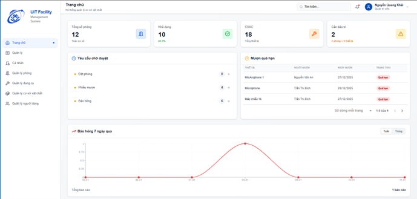

# UIT Facility Management System

## Introduction
This project is a full-stack web application that helps the University of Information Technology (UIT) manage classrooms, equipment, and usage schedules in a centralized and efficient way.  
The system enables users to search for available rooms, book rooms, borrow equipment, and report incidents; it also provides administrators with a statistics dashboard, request approvals, and comprehensive asset management—effectively eliminating schedule conflicts and manual tracking workflows.  
The project is built with Next.js + Tailwind CSS (frontend), NestJS + TypeScript (backend), and PostgreSQL, and is deployed production-ready on Railway with automated CI/CD.

## Features

### Dashboard (Home)


- Displays 4 key KPIs: total rooms, available rooms, total assets/equipment, and items requiring maintenance for a quick operational overview.
- Shows a “Pending Requests” panel grouped into 3 categories (room booking, borrowing tickets, incident reports) to help admins prioritize approvals.
- Provides an overdue borrowing table (equipment, borrower, borrow date, status) with pagination to support asset recovery and prevent loss.
- Includes an incident trend chart over time with weekly/monthly views to monitor issues and support maintenance decisions.


This is a [Next.js](https://nextjs.org) project bootstrapped with [`create-next-app`](https://nextjs.org/docs/app/api-reference/cli/create-next-app).

## Getting Started

First, run the development server:

```bash
npm run dev
# or
yarn dev
# or
pnpm dev
# or
bun dev
```

Open [http://localhost:3000](http://localhost:3000) with your browser to see the result.

You can start editing the page by modifying `app/page.tsx`. The page auto-updates as you edit the file.

This project uses [`next/font`](https://nextjs.org/docs/app/building-your-application/optimizing/fonts) to automatically optimize and load [Geist](https://vercel.com/font), a new font family for Vercel.

## Learn More

To learn more about Next.js, take a look at the following resources:

- [Next.js Documentation](https://nextjs.org/docs) - learn about Next.js features and API.
- [Learn Next.js](https://nextjs.org/learn) - an interactive Next.js tutorial.

You can check out [the Next.js GitHub repository](https://github.com/vercel/next.js) - your feedback and contributions are welcome!

## Deploy on Vercel

The easiest way to deploy your Next.js app is to use the [Vercel Platform](https://vercel.com/new?utm_medium=default-template&filter=next.js&utm_source=create-next-app&utm_campaign=create-next-app-readme) from the creators of Next.js.

Check out our [Next.js deployment documentation](https://nextjs.org/docs/app/building-your-application/deploying) for more details.
