# UIT Facility Management System

## Introduction
This project is a full-stack web application that helps the University of Information Technology (UIT) manage classrooms, equipment, and usage schedules in a centralized and efficient way.  
The system enables users to search for available rooms, book rooms, borrow equipment, and report incidents; it also provides administrators with a statistics dashboard, request approvals, and comprehensive asset management—effectively eliminating schedule conflicts and manual tracking workflows.  
The project is built with Next.js + Tailwind CSS (frontend), NestJS + TypeScript (backend), and PostgreSQL, and is deployed production-ready on Railway with automated CI/CD.

## Features

### Dashboard (Home)
<p align="center">
  
</p>

- Displays 4 key KPIs: total rooms, available rooms, total assets/equipment, and items requiring maintenance for a quick operational overview.
- Shows a “Pending Requests” panel grouped into 3 categories (room booking, borrowing tickets, incident reports) to help admins prioritize approvals.
- Provides an overdue borrowing table (equipment, borrower, borrow date, status) with pagination to support asset recovery and prevent loss.
- Includes an incident trend chart over time with weekly/monthly views to monitor issues and support maintenance decisions.

### Booking Approval (Room Requests)
<p align="center">
  
</p>

- Allows admins to approve or reject requests in the **Pending** status directly from each table row.
- After processing, the system updates the request status (**Approved/Rejected**) and locks further actions to prevent duplicate handling.
- Enables quick tracking of booking request history and ensures a transparent, consistent approval workflow.

### Borrowing Tickets Management
<p align="center">
  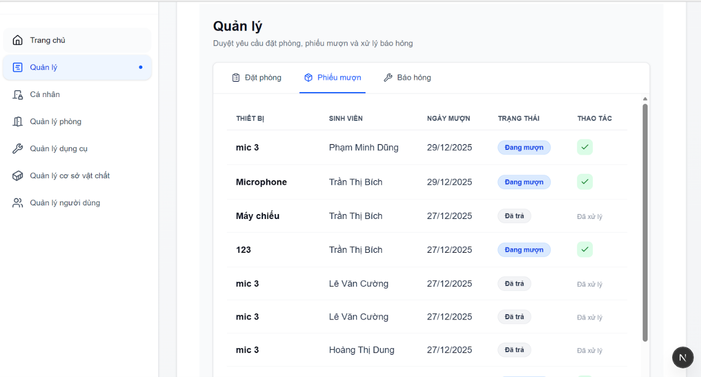
</p>

- Allows admins to confirm equipment returns for tickets currently in the **Borrowing** status directly from each row.
- Upon confirmation, the ticket status is updated to **Returned** and marked as **Processed**, while actions are disabled to avoid repeated confirmations.
- Centralizes borrow/return tracking to reduce asset loss and improve overall equipment control.

### Incident & Damage Reports Management
<p align="center">
  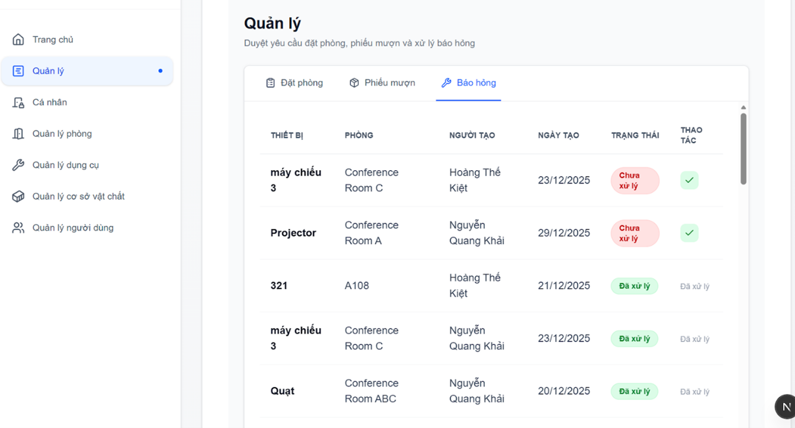
</p>

- Helps admins monitor and prioritize unresolved reports (**Unprocessed**) based on equipment/room details and created time.
- Provides a **Mark as Repaired** action to update the report once maintenance is completed.
- After confirmation, the report status changes to **Processed** and actions are locked to ensure consistent handling and prevent duplicate updates.

### Profile (Personal Page)
<p align="center">
  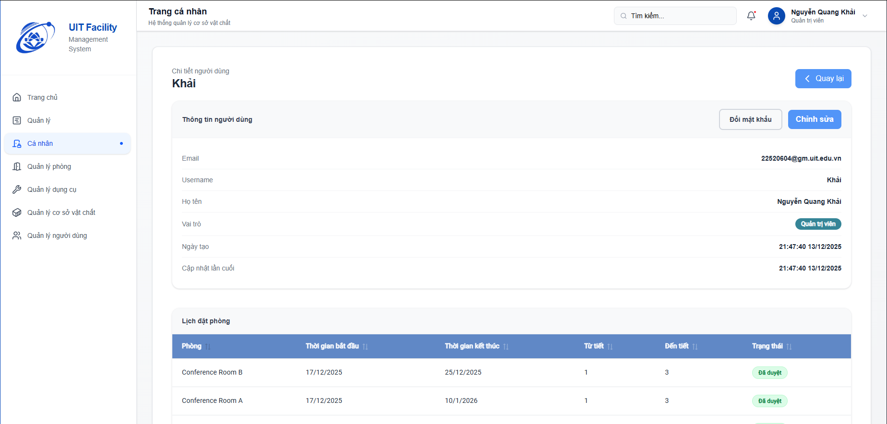
</p>

- Enables profile editing (username, full name) with an **Edit → Save/Cancel** workflow, while keeping email locked to preserve data integrity.
- Includes a **change password** feature with validation and secure updates after confirmation.
- Provides a user-filtered **personal booking history** table showing room, start/end time, periods, and approval status with colored labels.

### Rooms Management (Room List)
<p align="center">
  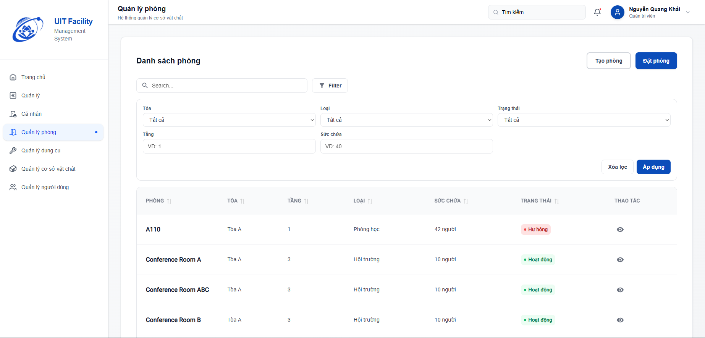
</p>

- Displays a paginated room list for Admin/User in table format (room name, building, floor, type, capacity, status) for efficient tracking.
- Supports keyword search to quickly find rooms by name/code.
- Implements multi-criteria filtering (building, room type, status, floor, capacity) to identify suitable rooms based on usage needs.

### Create Room
<p align="center">
  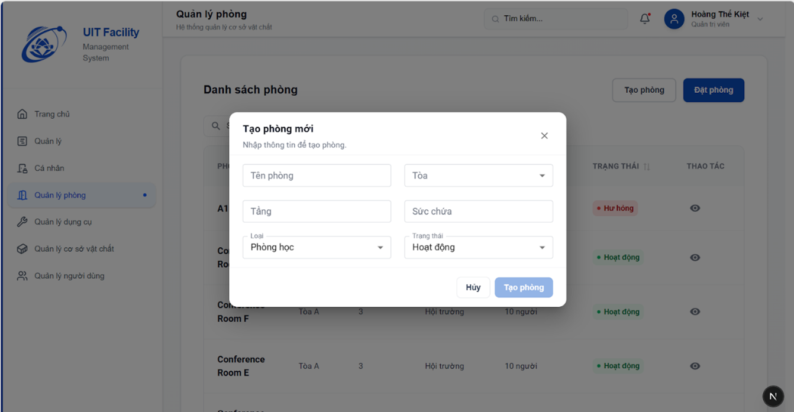
</p>

- Allows admins to create a new room by entering room name, building, floor, room type, capacity, and status; upon confirmation, the system persists the room data to the database.

### Room Details
<p align="center">
  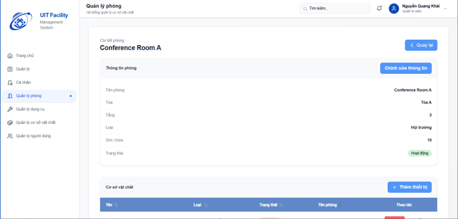
</p>
<p align="center">
  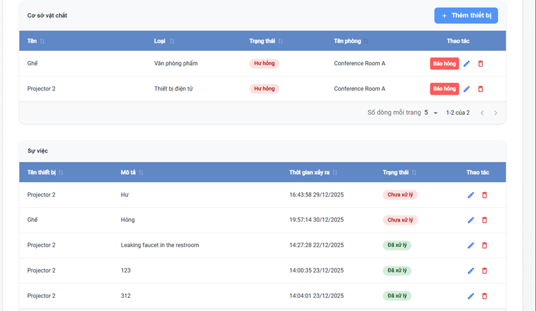
</p>
<p align="center">
  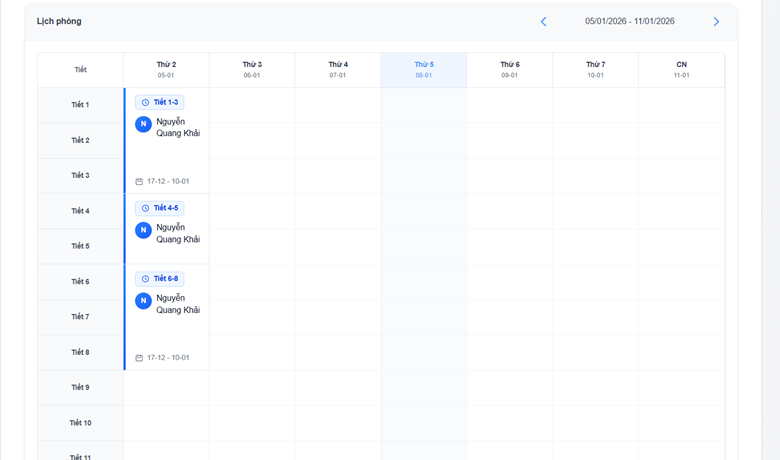
</p>

- Presents a block-based **room details** page for Admin/User, combining room info, assigned assets/equipment, incident reports, and booking history in a single view.
- Allows admins to **edit room information** (name, building, floor, type, capacity, status) and sync changes immediately after saving.
- Provides **room asset management**: add, edit, and delete equipment with quick actions directly in the assets table.
- Integrates an **incident reporting & tracking flow** per room: create reports from assets, monitor processing status, and edit/delete incidents when needed.
- Implements a **weekly room timetable (12 periods × 7 days)** with previous/next/today navigation, highlights approved bookings, and shows detailed tooltips (periods, requester, time range).

### Room Booking
<p align="center">
  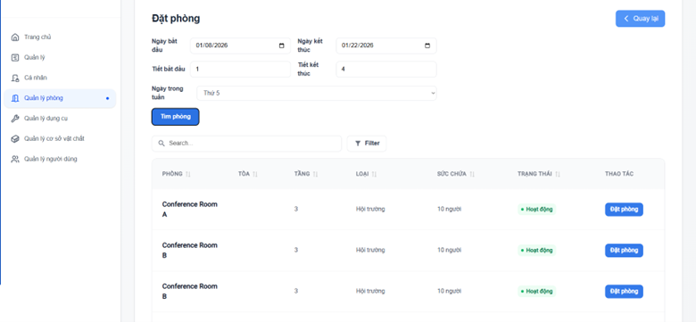
</p>

- Provides a **room booking** feature for Admin/User, allowing users to search available rooms by start/end dates, start/end periods, and day of the week.
- Displays available rooms in a table (room, building, floor, type, capacity, status) with a per-row **“Book Room”** CTA.
- When a booking is submitted, the system creates a room usage record with default status **Pending** for admin approval.

### Tools Management
<p align="center">
  
</p>

- Shows a centralized tools list for Admin/User in table format (tool name, description, usage status).
- Supports quick search by name/description; upon keyword + Enter, the system calls the backend and automatically refreshes results.
- Standardizes tool status display using colored labels (e.g., **Available / Borrowing**) for fast recognition.
- Enables admins to **create new tools** via an input modal, then refetches the list after creation.

### Tool Details
<p align="center">
  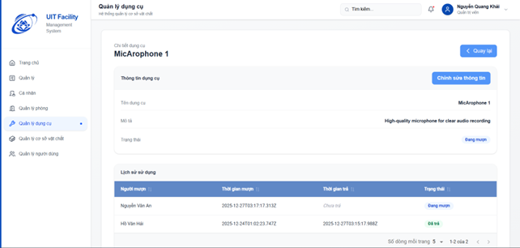
</p>

- Provides an admin **tool details** page showing full information (name, description, status) and usage history for borrow/return lifecycle tracking.
- Allows admins to edit tool data (name, description, status: **Available / Borrowing / Damaged**) to keep records accurate.
- Includes a per-tool borrow/return history table (borrower, borrow time, return time, status) to support auditing and traceability.

### Borrowing Ticket (Create)
<p align="center">
  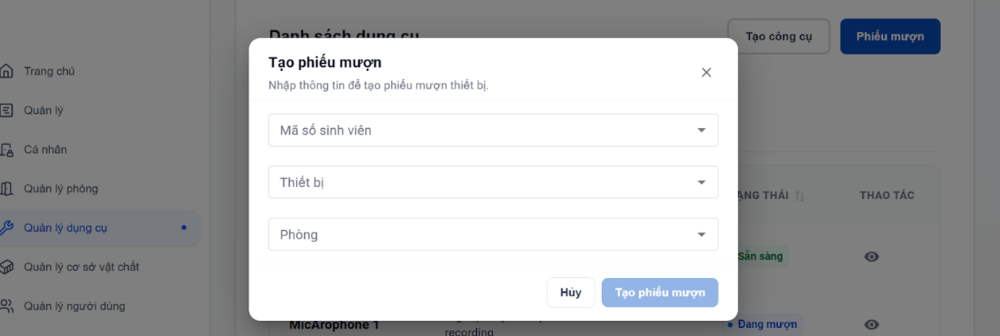
</p>

- Allows Admin/User to create a tool borrowing ticket via a popup/modal by selecting the borrower, tool, room, and borrowing time.
- Provides a fast form experience with dropdown/inputs and **Cancel / Create Ticket** actions directly from the tools flow.
- Upon confirmation, the system stores the ticket for management, usage tracking, and borrow–return reconciliation.

### Borrowing Tickets List
<p align="center">
  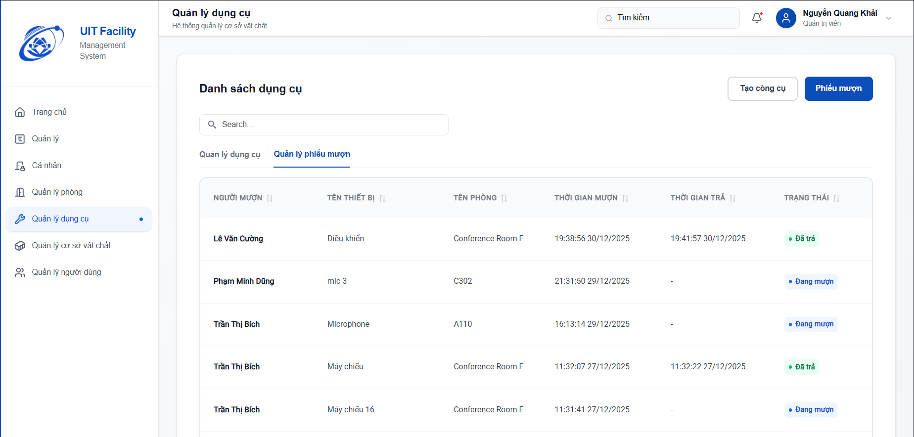
</p>

- Implements an admin **Borrowing Tickets Management** tab that displays all tickets in a consolidated table view.
- Shows full per-ticket details: borrower, tool, room, borrow/return time, and status for centralized monitoring.
- Standardizes ticket status with colored labels (**Borrowing / Returned**) to support control and historical traceability.

### Assets Management (Facilities & Equipment)
<p align="center">
  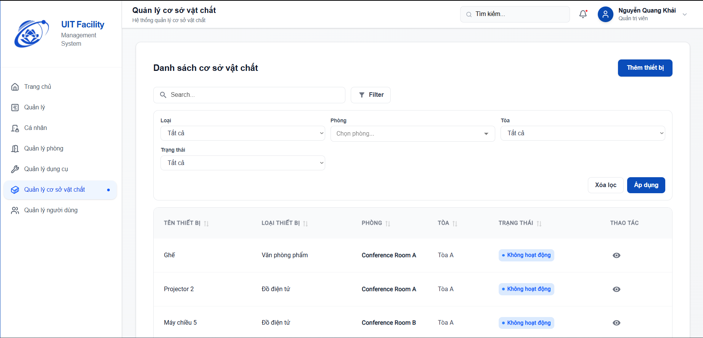
</p>

- Displays a paginated asset/equipment list for Admin in table format (device name, type, assigned room, building, status) for efficient management.
- Supports quick search by name/keyword; sends backend requests on Enter and updates results dynamically.
- Provides multi-criteria filtering (device type, room, building, status) with combinable conditions to narrow down results.
- Enables admins to **add new equipment** via an input modal and refetches the list immediately after creation.

### Asset Details & Incident History
<p align="center">
  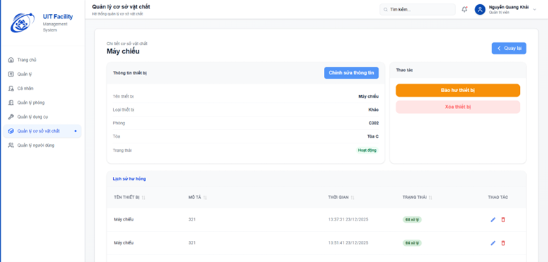
</p>

- Provides an admin **asset details** page with a clear block layout showing overview (name, type, room/building, status) and related incidents.
- Allows admins to edit equipment data (reassign room, update status, rename) and sync changes after saving.
- Integrates a **Report Damage** flow via a description modal to create incident tickets for tracking and resolution.
- Displays an incident history table (description, reported time, status, creator) for auditing and trend assessment.
- Supports incident update/delete (with delete confirmation) and equipment deletion (with confirmation) to prevent accidental actions.

### User Management
<p align="center">
  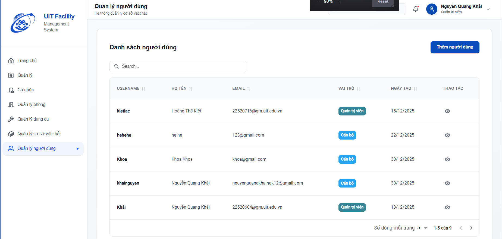
</p>
<p align="center">
  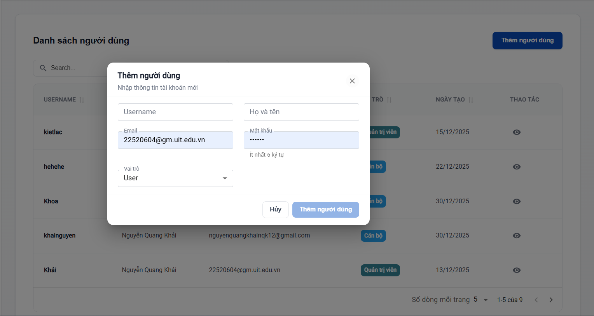
</p>

- Builds an admin **User Management** module with a paginated table (username, full name, email, role, created date) for efficient oversight.
- Supports quick search by username/full name/email with real-time filtering based on the entered keyword.
- Enables admins to **create new users** via a modal form (username, full name, email, password, role) with client-side validation before calling the backend.
- Standardizes role display using colored labels and provides an action column for quick user-related operations.


This is a [Next.js](https://nextjs.org) project bootstrapped with [`create-next-app`](https://nextjs.org/docs/app/api-reference/cli/create-next-app).

## Getting Started

First, run the development server:

```bash
npm run dev
# or
yarn dev
# or
pnpm dev
# or
bun dev
```

Open [http://localhost:3000](http://localhost:3000) with your browser to see the result.

You can start editing the page by modifying `app/page.tsx`. The page auto-updates as you edit the file.

This project uses [`next/font`](https://nextjs.org/docs/app/building-your-application/optimizing/fonts) to automatically optimize and load [Geist](https://vercel.com/font), a new font family for Vercel.

## Learn More

To learn more about Next.js, take a look at the following resources:

- [Next.js Documentation](https://nextjs.org/docs) - learn about Next.js features and API.
- [Learn Next.js](https://nextjs.org/learn) - an interactive Next.js tutorial.

You can check out [the Next.js GitHub repository](https://github.com/vercel/next.js) - your feedback and contributions are welcome!

## Deploy on Vercel

The easiest way to deploy your Next.js app is to use the [Vercel Platform](https://vercel.com/new?utm_medium=default-template&filter=next.js&utm_source=create-next-app&utm_campaign=create-next-app-readme) from the creators of Next.js.

Check out our [Next.js deployment documentation](https://nextjs.org/docs/app/building-your-application/deploying) for more details.
